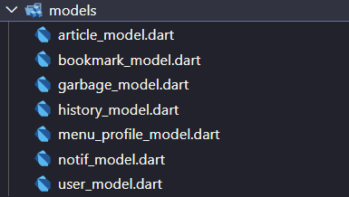
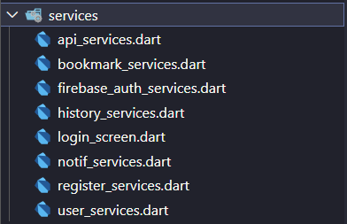
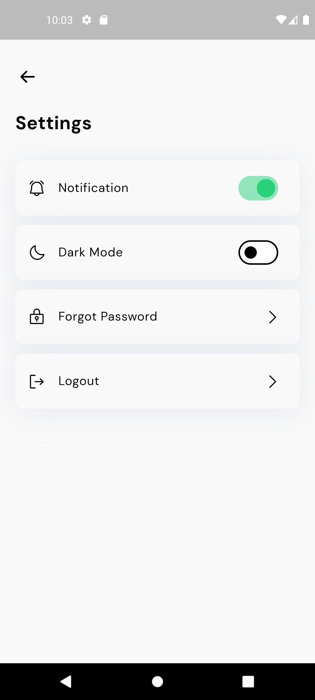
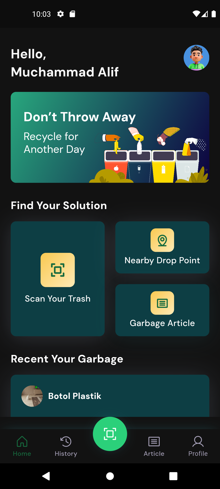

# Ecocycle

Ecocycle adalah aplikasi inovatif yang memberdayakan pengguna untuk memberikan dampak langsung terhadap kelestarian lingkungan. Memanfaatkan teknologi Google, aplikasi ini memberikan pengalaman intuitif dan menyenangkan untuk memindai dan mengelola sampah sehari-hari. Aplikasi ini menerapkan beberapa fitur antara lain, asynchronus programming, dark mode dengan shared preferences, dan stored local data dengan sqflite.
   

## 1. Asynchronus Programming

-   Models
    Dari gambar terlihat bahwa bagian model terdiri dari tiga file yaitu article_model.dart, bookmark_model.dart dan menu_profile_model.dart yang merupakan PODO (plain old dart objek) digunakan untuk membentuk format objek dari data json yang diperoleh dari server. PODO berfungsi sebagai wadah untuk menyusun data JSON menjadi struktur objek yang terstruktur dan mudah diakses oleh aplikasi. Berdasarkan dokumentasi API JSON, data artikel, bookmark, dan menu profil dapat diekstrak dari sumber JSON yang sama. Hal ini memungkinkan aplikasi untuk melakukan satu permintaan tunggal dengan URL endpoint yang sama untuk mengambil semua data yang diperlukan.
       

-   Screens
    Di bagian screens digunakan untuk menampilkan article dengan layout tampilan yang kode programnya terdapat dalam file article_screen.dart untuk daftar resep masakan dan article_detail.dart untuk detailnya. Beberapa file screen yang ada sebagai berikut :
       
    Tampilan layout yang dimaksud seperti gambar berikut:
       

-   Services
    Pada bagian services digunakan untuk mengambil API endpoint dari artikel tentang limbah yang terbaru dan juga bookmark untuk melakukan proses CRUD pada aplikasi ini.
       

## 2. Dark Mode dengan Shared Preferences

Dark Mode adalah fitur yang memungkinkan pengguna untuk mengubah tampilan antarmuka aplikasi menjadi latar belakang yang gelap dengan teks yang lebih terang. Dalam konteks pengembangan aplikasi Android, shared preferences adalah mekanisme penyimpanan data yang memungkinkan aplikasi untuk menyimpan preferensi pengguna, seperti pengaturan Dark Mode. Dengan menggunakan shared preferences, pengembang dapat menyimpan status Dark Mode yang dipilih oleh pengguna dan menggunakannya untuk mengatur tampilan aplikasi secara konsisten setiap kali aplikasi dibuka.

-   Switch pada halaman settings untuk mengatur gelap dan terang
       
-   Halaman Home saat Mode Terang
       
-   Halaman Home saat Mode Gelap
       

## 3. Stored local data dengan sqflite.

Stored local data dengan sqflite adalah mekanisme penyimpanan data lokal dalam pengembangan aplikasi Android menggunakan SQLite. Sqflite merupakan plugin Flutter yang memungkinkan pengembang untuk membuat, membaca, memperbarui, dan menghapus data dalam database SQLite secara efisien. Dengan menggunakan sqflite, pengembang dapat menyimpan data aplikasi seperti pengaturan pengguna, riwayat, atau informasi lainnya secara persisten di perangkat pengguna. Hal ini memungkinkan pengguna untuk mengakses dan mengelola data secara lokal dengan mudah, seperti menyimpan bookmark atau artikel berita dalam aplikasi.
   

## Paket yang Digunakan

google_fonts: ^6.1.0 (https://pub.dev/packages/google_fonts) 
persistent_bottom_nav_bar: ^5.0.2 (https://pub.dev/packages/persistent_bottom_nav_bar) 
flutter_staggered_grid_view: ^0.7.0 (https://pub.dev/packages/flutter_staggered_grid_view) 
phosphor_flutter: ^2.0.1 (https://pub.dev/packages/phosphor_flutter) 
expandable: ^5.0.1 (https://pub.dev/packages/expandable) 
firebase_core: ^2.27.0 (https://pub.dev/packages/firebase_core) 
shared_preferences: ^2.2.3 (https://pub.dev/packages/shared_preferences) 
http: ^1.2.0 (https://pub.dev/packages/http) 
intl: ^0.19.0 (https://pub.dev/packages/intl) 
sqflite: ^2.3.2 (https://pub.dev/packages/sqflite) 
path: ^1.8.3 (https://pub.dev/packages/path) 

## Referensi

Dokumentasi JSON API dan URL endpoint yang digunakan di program dapat diakses di:
https://newsapi.org/

## Getting Started

This project is a starting point for a Flutter application.

A few resources to get you started if this is your first Flutter project:

-   [Lab: Write your first Flutter app](https://docs.flutter.dev/get-started/codelab)
-   [Cookbook: Useful Flutter samples](https://docs.flutter.dev/cookbook)

For help getting started with Flutter development, view the
[online documentation](https://docs.flutter.dev/), which offers tutorials,
samples, guidance on mobile development, and a full API reference.
